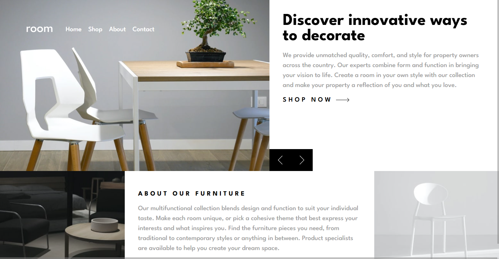
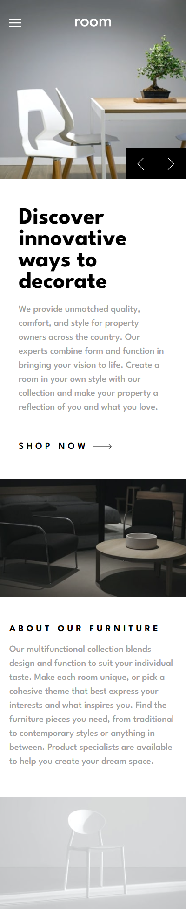

# Frontend Mentor - Room homepage solution

This is a solution to the [Room homepage challenge on Frontend Mentor](https://www.frontendmentor.io/challenges/room-homepage-BtdBY_ENq). Frontend Mentor challenges help you improve your coding skills by building realistic projects. 

## Table of contents

- [Overview](#overview)
  - [The challenge](#the-challenge)
  - [Screenshot](#screenshot)
  - [Links](#links)
- [My process](#my-process)
  - [Built with](#built-with)
  - [What I learned](#what-i-learned)
  - [Continued development](#continued-development)
  - [Useful resources](#useful-resources)
- [Author](#author)
- [Acknowledgments](#acknowledgments)

## Overview

### The challenge

Users should be able to:

- View the optimal layout for the site depending on their device's screen size
- See hover states for all interactive elements on the page
- Navigate the slider using either their mouse/trackpad or keyboard

### Screenshot




### Links

- Solution URL: https://github.com/DanKRT-Star/development-room-homepage-master
- Live Site URL: https://development-room-homepage-master.vercel.app/

## My process

### Built with

- Semantic HTML5 markup
- CSS custom properties
- Flexbox
- CSS Grid
- Mobile-first workflow
- Vanilla JavaScript

### What I learned

- How to use CSS Grid and Flexbox to build a responsive layout for both desktop and mobile.
- Applied custom properties (CSS variables) for easier color and font management.
- Wrote JavaScript to control the image/content slider and toggle the mobile menu.
- Used click events to toggle menu and slider states.
- Optimized the interface for different screen sizes using media queries.

Example code:
```js
const toggleMenuOpen = () => document.querySelector('header').classList.toggle('open');
```
```css
header.open .overlay {
  display: block;
  opacity: 1;
}
```

### Continued development

- Will continue to improve slider transitions and optimize user experience on mobile.
- Enhance JavaScript DOM manipulation and animation skills.
- Learn more about accessibility for menu and slider components.

### Useful resources

- [MDN Web Docs](https://developer.mozilla.org/) - Reference for HTML, CSS, JavaScript.
- [Frontend Mentor Community](https://www.frontendmentor.io/community) - Support and experience sharing.

## Author

- Frontend Mentor - [@DanKRT-Star]https://www.frontendmentor.io/profile/DanKRT-Star
- Facebook - [Lê Mạnh Đan](https://www.facebook.com/le.manh.an.887330)
- Gmail - [Lê Mạnh Đan](tonyle1207@gmail.com)
- Github - [Lê Mạnh Đan](https://github.com/DanKRT-Star)

## Acknowledgments

Thanks to Frontend Mentor for providing this challenge and to the community for their helpful feedback and resources!

